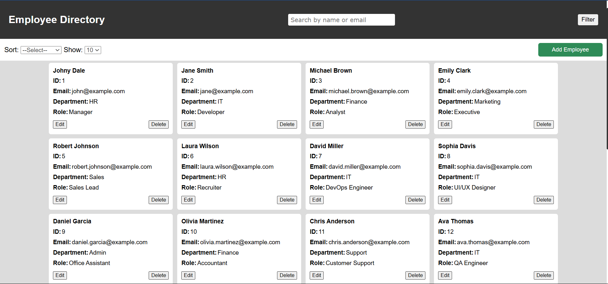
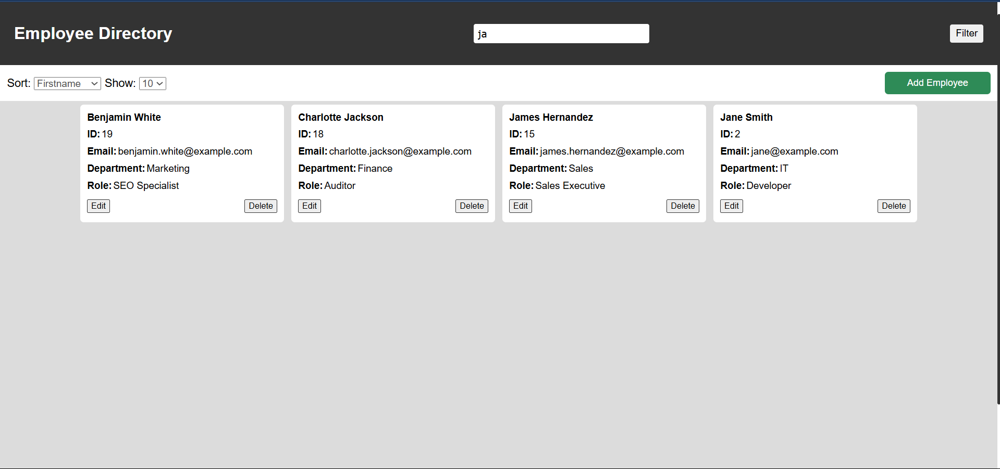
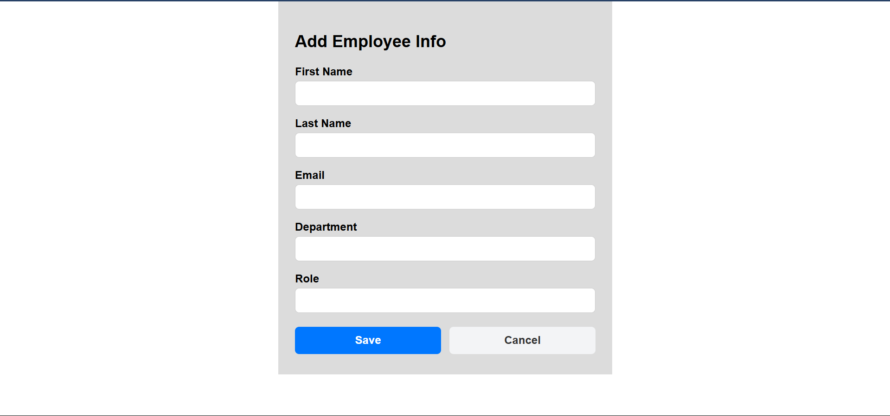
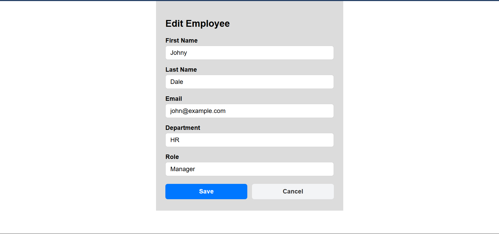

# 🗂️ Employee Directory Web Interface

A responsive and interactive employee directory built using **HTML**, **CSS**, and **Vanilla JavaScript**, with data stored and managed in-browser using `localStorage`. This project simulates real-world front-end functionality without any backend or template engine.

---

## ✅ Features Implemented

- 📋 **Dashboard** displaying employees:  
  ID, First Name, Last Name, Email, Department, Role
- ✏️ **Edit / Delete** employee entries  
- ➕ **Add new employee** with validation
- 🔍 **Search** by name or email
- ↕️ **Sort** by First Name (A–Z) and by Department (A-Z)
- 📱 **Responsive design** for mobile and desktop
- ✅ **Infinite Scroll**: Loads more employees as you scroll instead of traditional pagination
- 🧠 **Validation** for required fields & email format
- 💾 **Data persistence** via `localStorage`

---

## 🚫 Not Implemented

- ❌ Filter popup UI (filtering logic ready, but no toggle button/popup yet)
- ❌ Freemarker (static implementation only)
- ❌ **Pagination** (10 / 25 / 50 / 100 entries) not implemented

---

## 📁 Project Structure
    employee-directory/
        ├── dist/
        │    ├── index.html # Main dashboard page
        │    ├── form.html # Add/Edit employee page
        │    ├── js/
        │    │    ├── data.js # Initial mock employee data
        │    │    └── app.js # Core JS logic (render, edit, delete, etc.)
        │    └── css/
        │         └── style.css # All styles
        └── README.md

---

## ▶️ How to Run

> No build or backend setup required.

1. Clone or download this repo.
2. Open `index.html` in any browser.
3. To edit an employee, the app navigates to: `form.html?editId={id}`

---

## ▶️ Project Screenshots

---

## 💡 Future Improvements

- Add filter toggle button + popup UI
- Show toast/alerts on save/delete
- Reset/clear filters and sorting
- Optional Freemarker/Java integration

---

## 🙋 Author

- [PraveenKumar Dasari](https://github.com/daaspraveen)